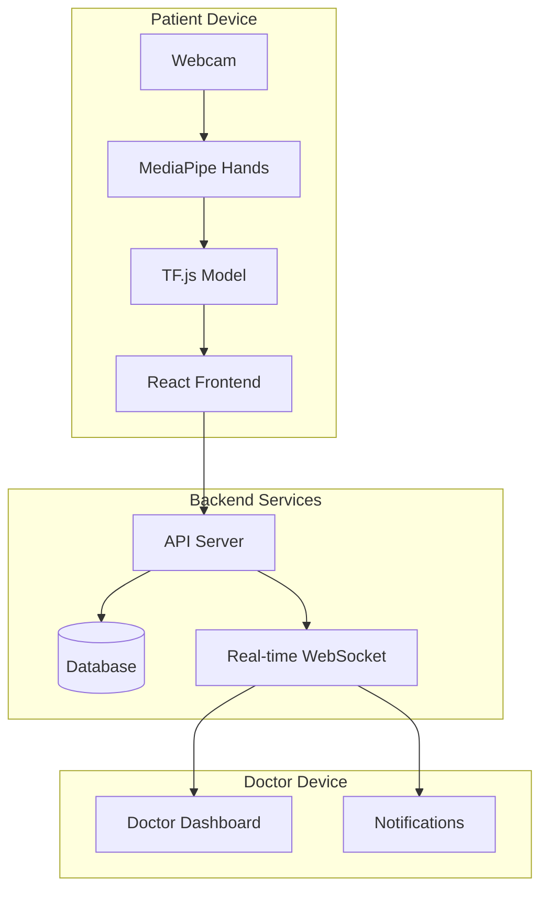
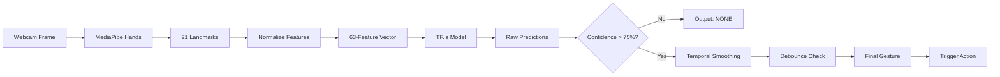
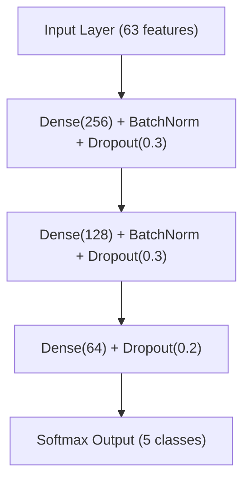
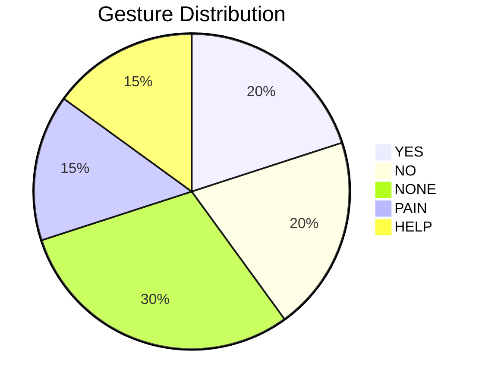
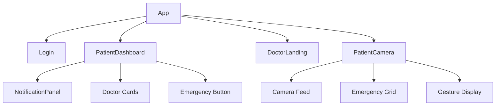
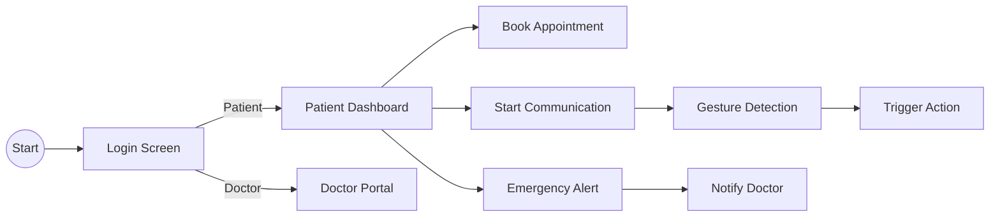
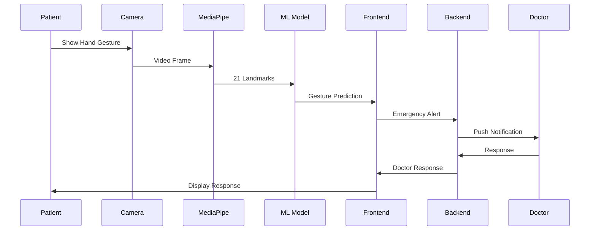
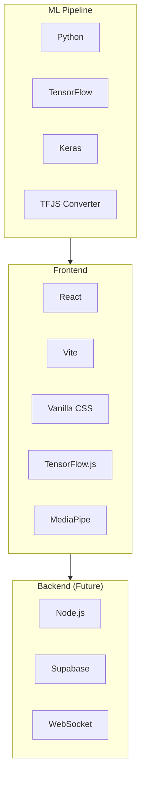

# GestureHeal — Architecture Diagrams

---

## 1. High-Level System Architecture

---

## 2. ML Inference Pipeline

---

## 3. Model Architecture

---

## 4. Gesture Classes

---

## 5. Frontend Component Tree

---

## 6. User Flow

---

## 7. Data Flow

---

## 8. Technology Stack

---

*Note: Copy Mermaid code blocks into Mermaid Live Editor or compatible presentation tool to render diagrams.*
